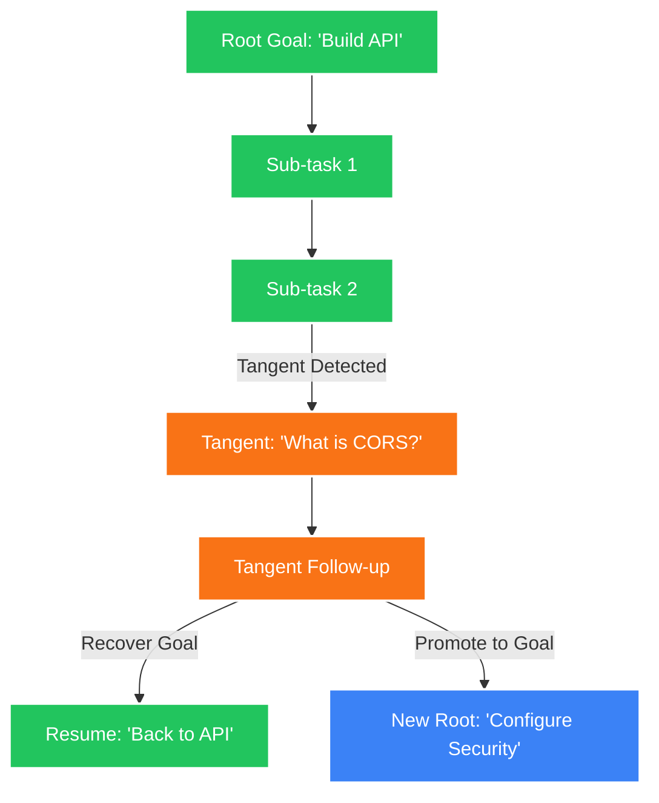

# 🧠 ADHD Cognitive Copilot Engine

[](https://www.python.org/)
[](https://fastapi.tiangolo.com)
[](https://streamlit.io/)
[](https://opensource.org/licenses/MIT)

> **An agentic AI coding assistant and dialogue management engine engineered to anchor cognitive focus and structure organic conversational tangents via Directed Acyclic Graphs (DAGs).**

---

## 📖 Executive Summary

The **ADHD Cognitive Copilot** is a high-fidelity workspace designed to resolve the tension between strict task execution and natural human curiosity. It leverages a state-machine architecture and a proprietary **DAG-based memory engine** to map conversational flows structurally. 

Instead of linear chat histories that lose context when users go off-topic, this engine branches tangents dynamically. It provides users with a fixed anchor to their primary goal, alongside explicit UI controls to gracefully recover context or promote productive tangents into the new primary focus.

## ⚡ Core Capabilities

- **Stateful Cognitive Anchoring**: Utilizes Google Gemini 2.5 Flash to synthesize initial user inputs into concise, actionable primary goals.
- **Dynamic Tangent Branching**: Evaluates inter-prompt dependencies in real-time. Unrelated queries are dynamically routed into discrete "Tangent" branches without polluting the main execution context.
- **Hybrid Recovery Mechanisms**: Offers one-click context recovery (`Recover Goal`) and contextual pivots (`Promote to Main Goal`), leveraging LLMs to synthesize complex conversation branches into newly focused objectives.
- **Real-Time Graph Visualization**: Compiles the active memory DAG into an interactive HTML visualization using `NetworkX` and `PyVis`, allowing users to inspect their cognitive footprint.
- **Behavioral State Detection**: Monitors interaction cadences and input density to detect "fragmented" cognitive states, automatically adjusting AI response brevity and structure to accommodate user bandwidth.

---

## 🏗️ System Architecture

The memory engine treats conversations as nodes in a graph. Main goals form the root branch, while detours spawn localized sub-graphs.



---

## 🚀 Getting Started

### Prerequisites
- **Python**: `3.9` or higher
- **API Keys**: Google Gemini API Key (`gemini-2.5-flash` access)

### Local Environment Setup

1. **Clone the Repository**
   ```bash
   git clone https://github.com/your-org/adhd-cognitive-copilot.git
   cd adhd-cognitive-copilot
   ```

2. **Initialize Virtual Environment**
   ```bash
   python -m venv venv
   # Windows
   .\venv\Scripts\activate
   # Unix/macOS
   source venv/bin/activate
   ```

3. **Install Dependencies**
   ```bash
   pip install -r requirements.txt
   ```

4. **Environment Configuration**
   Create a `.env` file at the project root:
   ```env
   GEMINI_API_KEY=your_gemini_api_key_here
   ```

### Running the System

The architecture requires running the FastAPI backend and Streamlit frontend concurrently.

**Terminal 1: Core Backend**
```bash
# Ensure you are at the project root
uvicorn backend.app:app --reload --port 8000
```

**Terminal 2: Frontend Client**
```bash
# Ensure you are at the project root
streamlit run frontend/ui.py
```

Access the UI at [http://localhost:8501](http://localhost:8501).

---

## 📡 API Reference (Backend)

The core engine exposes a RESTful interface for UI integration or headless operation.

| Endpoint | Method | Description |
|----------|--------|-------------|
| `/state` | `GET` | Retrieves the current `SessionState` (active goal, node IDs, cognitive status). |
| `/chat` | `POST` | Primary conversational router. Handles dependency evaluation and graph node generation. |
| `/visualize`| `GET` | Compiles the active DAG into an interactive `dag_visual.html` payload. |
| `/recover-root` | `POST` | Forces synthesis of current tangent and re-attaches context to the main branch. |
| `/promote-goal` | `POST` | Synthesizes the current tangent logs into a new primary goal and pivots the root ID. |
| `/reset` | `POST` | Flushes the `MemoryGraphManager` and re-initializes session state. |

---

## 📂 Repository Structure

```text
adhd-cognitive-copilot/
├── backend/
│   ├── app.py               # FastAPI application core & route definitions
│   ├── classifier.py        # Heuristics & LLM prompt injection for dependency checking
│   ├── memory_engine.py     # NetworkX graph orchestration & Pydantic state models
│   └── router.py            # Primary state machine, edge routing, and node injection
├── frontend/
│   └── ui.py                # Streamlit client, UI logic, and session hydration
├── evaluate.py              # CI/CD evaluation scripts
├── requirements.txt         # Dependency lockfile
├── .env                     # Secret injection
└── .gitignore               # SCM exclusion rules
```

---

## 🤝 Contribution Guidelines

1. **Branching Strategy**: Use `feature/issue-number-description` for new features and `hotfix/issue-number` for patches.
2. **Commit Standards**: We strictly adhere to [Conventional Commits](https://www.conventionalcommits.org/en/v1.0.0/).
3. **Graph Integrity**: When contributing to `memory_engine.py`, ensure all new node insertions correctly inherit `parent_id` and maintain `root_id` traceability. Orphaned nodes will cause traversal failures.

## 📄 License

This software is released under the **MIT License**. See the [LICENSE](LICENSE) file for comprehensive legal parameters.
